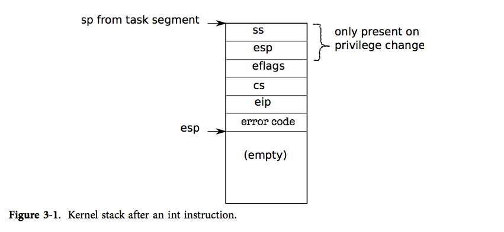

## 第3章

### 陷入，中断和驱动程序

一个进程在运行时，cpu 处于一个大循环中：取指，更新 PC，执行，取指……。但有些情况下用户程序需要进入内核，而不是执行下一条用户指令。这些情况包括设备发出一个信号、用户程序的非法操作（例如引用一个找不到页表项的虚拟地址）、或者用户通过调用请求系统服务。处理好这些情况面临三大挑战：1）内核必须使处理器能够从用户态转换到内核态（并且再转换回用户态）2）内核和设备必须协调好他们并行的活动。3）内核必须知道硬件接口的细节。解决这三个问题需要对硬件的深入理解和谨慎仔细的编程，并且还有可能产生难以理解的内核代码。这一章告诉你 xv6 是如何解决这些问题的。

#### 系统调用，异常和中断

正如我们上一章最后所见，用户程序通过系统调用请求系统服务。术语`exception`指产生中断的非法程序操作，例如除以0，尝试访问 PTE 不存在的内存等等。术语`interrupt`指硬件产生的希望引起操作系统注意的信号，例如时钟芯片可能每100毫秒产生一个中断，以此来实现分时。再举一个例子，当硬盘读完一个数据块时，它会产生一个中断来提醒操作系统这个块已经准备好被获取了。

所有的中断都由内核管理，而不是进程。因为在大多数情况下只有内核拥有处理中断所需的特权和状态。例如为了使进程响应时钟中断而在进程间实现时间分片，就必须在内核中执行这些操作，因为我们有可能强迫进程服从处理器的调度。

在所有这三种情况下，操作系统的设计必须保证下面这些条件。系统必须保存寄存器以备将来的状态恢复。系统必须准备好在内核中执行。系统必须选择一个地方让内核能够开始执行。内核必须能够获得关于这个事件的信息，例如系统调用的参数。同时还必须保证安全性；系统必须保持用户进程和系统进程的隔离。

为了达成这个目标操作系统必须知道硬件是如何处理系统调用、异常和中断的。在大多数处理器中这三种事件都用同样的硬件机制处理。比如说，在 x86 中，一个程序可以通过 int 指令产生一个中断来进行系统调用。同样的，异常也会产生一个中断。因此，如果操作系统能够处理中断，那么操作系统也可以处理系统调用以及异常。

我们的计划是这样的。中断终止正常的处理器循环然后开始执行中断处理程序中的代码。在开始中断处理程序之前，处理器保存寄存器，这样在操作系统从中断中返回时就可以恢复他们。切换到中断服务程序面临的问题是处理器需要在用户模式和内核模式之间切换。

最后有关术语的一些问题：虽然 x86 官方术语是中断（interrupt），xv6 都用陷入（trap）来指他们，很大程度上是因为这个术语被 PDP11/40 使用，从而也是传统的 Unix 术语。这一章交替使用陷入和中断这两个术语，但一定要记住陷入是由在 cpu 上运行的当前进程导致的，而中断是由设备导致的，可能与当前进程毫无关系。比如说，磁盘可能在接受了一个进程的数据块之后发出一个中断，但是在中断的时候可能运行的是其他进程。中断的这一特性使得思考中断的相关问题比陷入要难，因为中断和其它活动是并行的。然而正如我们马上就要讨论的，他们都依赖相同的硬件机制在用户模式和内核模式之间进行切换。

### X86 的保护机制

x86 有四个特权级，从 0（特权最高）编号到 3（特权最低）。在实际使用中，大多数的操作系统都使用两个特权级，0 和 3，他们被称为内核模式和用户模式。当前执行指令的特权级存在于 %cs 寄存器中的 CPL 域中。

在 x86 中，中断处理程序的入口在中断描述符表（IDT）中被定义。这个表有256个表项，每一个都提供了相应的 %cs 和 %eip。

一个程序要在 x86 上进行一个系统调用，它需要调用 int n 指令，这里 n 就是 IDT 的索引。int 指令进行下面一些步骤：
* 从 IDT 中获得第 n 个描述符，n 就是 int 的参数。
* 检查 %cs 的域 CPL <= DPL，DPL 是描述符中记录的特权级。
* 如果目标段选择符的 PL < CPL，就在 CPU 内部的寄存器中保存 %esp 和 %ss 的值。
* 从一个任务段描述符中加载 %ss 和 %esp。
* 将 %ss 压栈。
* 将 %esp 压栈。
* 将 %eflags 压栈。
* 将 %cs 压栈。
* 将 %eip 压栈。
* 清除 %eflags 的一些位。
* 设置 %cs 和 %eip 为描述符中的值。

int 指令是一个非常复杂的指令，可能有人会问是不是所有的这些操作都是必要的。检查 CPL <= DPL 使得内核可以禁止一些特权级系统调用。例如，如果用户成功执行了 int 指令，那么 DPL 必须是 3。如果用户程序没有合适的特权级，那么 int 指令就会触发 int 13，这是一个通用保护错误。再举一个例子，int 指令不能使用用户栈来保存值，因为用户可能还没有建立一个合适的栈，因此硬件会使用任务段中指定的栈（这个栈在内核模式中建立）。

图 3-1 展示了一个 int 指令之后的栈的情况，注意这是发生了特权级转换（即描述符中的特权级比 CPL 中的特权级低的时候）栈的情况。如果这条指令没有导致特权级转换，x86 就不会保存 %ss 和 %esp。在任何一种情况下，%eip 都指向中断描述符表中指定的地址，这个地址的第一条指令就是将要执行的下一条指令，也是 int n 的中断处理程序的第一条指令。操作系统应该实现这些中断处理程序，之后我们会看到 xv6 干了些什么。

操作系统可以使用 iret 指令来从一个 int 指令中返回。它从栈中弹出 int 指令保存的值，然后通过恢复保存的 %eip 的值来继续用户程序的执行。

### 代码：第一个系统调用

第一章的最后在 `initcode.S` 中调用了一个系统调用。让我们再看一遍（8213）。这个进程将 `exec` 所需的参数压栈，然后把系统调用号存在 %eax 中。这个系统调用号和 syscalls 数组中的条目匹配，（syscall 是一个函数指针的数组）（3600）。我们需要设法使得 int 指令将处理器的状态从用户模式切换到内核模式，调用适当的内核函数（例如在这里是 `sys_exec`），并且使内核可以取出 `sys_exec` 的参数。接下来的几个小节将描述 xv6 是如何做到这一点的，你会发现我们可以用同样的代码来实现中断和异常。

### 代码：汇编陷入处理程序

xv6 必须设置硬件在遇到 int 指令时进行一些特殊的操作，这些操作会使处理器产生一个中断。x86 允许 256 个不同的中断。中断 0-31 被定义为软件异常，比如除 0 错误和访问非法的内存页。xv6 将中断号 32-63 映射给硬件中断，并且用 64 作为系统调用的中断号。

`Tvinit` (3317) 在 `main` 中被调用，它设置了 `idt` 表中的 256 个表项。中断 i 被位于 `vectors[i]` 的代码处理。每一个中断处理程序的入口点都是不同的，因为 x86 并未把中断号传递给中断处理程序，使用 `256` 个不同的处理程序是区分这 256 种情况的唯一办法。

`Tvinit` 处理 `T_SYSCALL`，用户系统会调用 trap，特别地：它通过传递第二个参数值为 1 来指定这是一个陷阱门。陷阱门不会清除 FL 位，这使得在处理系统调用的时候也接受其他中断。

同时也设置系统调用门的权限为 DPL_USER，这使得用户程序可以通过 int 指令产生一个内陷。xv6 不允许进程用 int 来产生其他中断（比如设备中断）；如果它们这么做了，就会抛出通用保护异常，也就是发出 13 号中断。

当特权级从用户模式向内核模式转换时，内核不能使用用户的栈，因为它可能不是有效的。用户进程可能是恶意的或者包含了一些错误，使得用户的 %esp 指向一个不是用户内存的地方。xv6 会使得在内陷发生的时候进行一个栈切换，栈切换的方法是让硬件从一个任务段描述符中读出新的栈选择符和一个新的 %esp 的值。函数 `switchuvm`（1873）把用户进程的内核栈顶地址存入任务段描述符中。

当内陷发生时，处理器会做下面一些事。如果处理器在用户模式下运行，它会从任务段描述符中加载 %esp 和 %ss，把老的 %ss 和 %esp 压入新的栈中。如果处理器在内核模式下运行，上面的事件就不会发生。处理器接下来会把 %eflags，%cs，%eip 压栈。对于某些内陷来说，处理器会压入一个错误字。而后，处理器从相应 IDT 表项中加载新的 %eip 和 %cs。

xv6 使用一个 perl 脚本（3200）来产生 IDT 表项指向的中断处理函数入口点。每一个入口都会压入一个错误码（如果 CPU 没有压入的话），压入中断号，然后跳转到 `alltraps`。

`Alltraps`（3254）继续保存处理器的寄存器：它压入 %ds, %es, %fs, %gs, 以及通用寄存器（3255-3260)。这么做使得内核栈上压入一个 `trapframe`（中断帧） 结构体，这个结构体包含了中断发生时处理器的寄存器状态（参见图3-2）。处理器负责压入 %ss，%esp，%eflags，%cs 和 %eip。处理器或者中断入口会压入一个错误码，而`alltraps`负责压入剩余的。中断帧包含了所有处理器从当前进程的内核态恢复到用户态需要的信息，所以处理器可以恰如中断开始时那样继续执行。回顾一下第一章，`userinit`通过手动建立中断帧来达到这个目标（参见图1-3）。

考虑第一个系统调用，被保存的 %eip 是 int 指令下一条指令的地址。%cs 是用户代码段选择符。%eflags 是执行 int 指令时的 eflags 寄存器，`alltraps` 同时也保存 %eax，它存有系统调用号，内核在之后会使用到它。

现在用户态的寄存器都保存了，`alltraps` 可以完成对处理器的设置并开始执行内核的 C 代码。处理器在进入中断处理程序之前设置选择符 %cs 和 %ss；`alltraps` 设置 %ds 和 %es（3263-3265）。它设置 %fs 和 %gs 来指向 `SEG_KCPU`（每个 CPU 数据段选择符）（3266-3268）。

一旦段设置好了，`alltraps` 就可以调用 C 中断处理程序 `trap` 了。它压入 %esp 作为 `trap` 的参数，%esp 指向刚在栈上建立好的中断帧（3271）。然后它调用 `trap`（3272）。trap 返回后，`alltraps` 弹出栈上的参数（3273）然后执行标号为 `trapret` 处的代码。我们在第一章阐述第一个用户进程的时候跟踪分析了这段代码，在那里第一个用户进程通过执行 `trapret` 处的代码来退出到用户空间。同样地事情在这里也发生：弹出中断帧会恢复用户模式下的寄存器，然后执行 iret 会跳回到用户空间。

现在我们讨论的是发生在用户模式下的中断，但是中断也可能发生在内核模式下。在那种情况下硬件不需要进行栈转换，也不需要保存栈指针或栈的段选择符；除此之外的别的步骤都和发生在用户模式下的中断一样，执行的 xv6 中断处理程序的代码也是一样的。而 `iret` 会恢复了一个内核模式下的 %cs，处理器也会继续在内核模式下执行。

### 代码：C 中断处理程序

我们在上一节中看到每一个处理程序会建立一个中断帧然后调用 C 函数 `trap`。`trap`（3351）查看硬件中断号 `tf->trapno` 来判断自己为什么被调用以及应该做些什么。如果中断是 `T_SYSCALL`，`trap` 调用系统调用处理程序 `syscall`。我们会在第五章再来讨论这里的两个 `cp->killed` 检查。

当检查完是否是系统调用，`trap` 会继续检查是否是硬件中断（我们会在下面讨论）。中断可能来自硬件设备的正常中断，也可能来自异常的、未预料到的硬件中断。

如果中断不是一个系统调用也不是一个硬件主动引发的中断，`trap` 就认为它是一个发生中断前的一段代码中的错误行为导致的中断（如除零错误）。如果产生中断的代码来自用户程序，xv6 就打印错误细节并且设置 `cp->killed` 使之待会被清除掉。我们会在第五章看看 xv6 是怎样进行清除的。

如果是内核程序正在执行，那就出现了一个内核错误：`trap` 打印错误细节并且调用 `panic`。

### 代码：系统调用

对于系统调用，`trap` 调用 `syscall`（3625）。`syscall` 从中断帧中读出系统调用号，中断帧也包括被保存的 %eax，以及到系统调用函数表的索引。对第一个系统调用而言，%eax 保存的是 SYS_exec（3457），并且 `syscall` 会调用第 `SYS_exec` 个系统调用函数表的表项，相应地也就调用了 `sys_exec`。

`syscall` 在 %eax 保存系统调用函数的返回值。当 `trap` 返回用户空间时，它会从 `cp->tf` 中加载其值到寄存器中。因此，当 `exec` 返回时，它会返回系统调用处理函数返回的返回值（3631）。系统调用按照惯例会在发生错误的时候返回一个小于 0 的数，成功执行时返回正数。如果系统调用号是非法的，syscall 会打印错误并且返回 -1。

之后的章节会讲解系统调用的实现。这一章关心的是系统调用的机制。还有一点点的机制没有说到：如何获得系统调用的参数。工具函数 `argint`、`argptr` 和 `argstr` 获得第 n 个系统调用参数，他们分别用于获取整数，指针和字符串起始地址。argint 利用用户空间的 %esp 寄存器定位第 n 个参数：%esp 指向系统调用结束后的返回地址。参数就恰好在 %esp 之上（%esp+4）。因此第 n 个参数就在 %esp+4+4*n。

`argint` 调用 `fetchint` 从用户内存地址读取值到 `*ip`。`fetchint` 可以简单地将这个地址直接转换成一个指针，因为用户和内核共享同一个页表，但是内核必须检验这个指针的确指向的是用户内存空间的一部分。内核已经设置好了页表来保证本进程无法访问它的私有地址以外的内存：如果一个用户尝试读或者写高于（包含）p->sz的地址，处理器会产生一个段中断，这个中断会杀死此进程，正如我们之前所见。但是现在，我们在内核态中执行，用户提供的任何地址都是有权访问的，因此必须要检查这个地址是在 p->sz 之下的。

`argptr` 和 `argint` 的目标是相似的：它解析第 n 个系统调用参数。`argptr` 调用 `argint` 来把第 n 个参数当做是整数来获取，然后把这个整数看做指针，检查它的确指向的是用户地址空间。注意 `argptr` 的源码中有两次检查。首先，用户的栈指针在获取参数的时候被检查。然后这个获取到得参数作为用户指针又经过了一次检查。

`argstr` 是最后一个用于获取系统调用参数的函数。它将第 n 个系统调用参数解析为指针。它确保这个指针是一个 NUL 结尾的字符串并且整个完整的字符串都在用户地址空间中。

系统调用的实现（例如，sysproc.c 和 sysfile.c）仅仅是封装而已：他们用 `argint`，`argptr` 和 `argstr` 来解析参数，然后调用真正的实现。在第一章，`sys_exec` 利用这些函数来获取参数。

### 代码：中断

主板上的设备可以产生中断，xv6 必须配置硬件来处理这些中断。没有硬件的支持 xv6 不可能正常使用起来：用户不能够用键盘输入，没有一个能够存储数据的文件系统等等。幸运的是，添加一些简单设备的中断并不会增加太多额外的复杂性。正如我们将会见到的，中断可以使用与系统调用和异常处理相同的代码。

中断和系统调用相似，除了它可以在任何时候产生。主板上的硬件能够在需要的时候向 CPU 发出信号（例如用户在键盘上输入了一个字符）。我们得对设备编程来产生一个中断，然后令 CPU 接受它们的中断。

我们来看一看分时硬件和时钟中断。我们希望分时硬件大约以每秒 100 次的速度产生一个中断，这样内核就可以对进程进行时钟分片。100 次每秒的速度足以提供良好的交互性能并且同时不会使处理器进入不断的中断处理中。

像 x86 处理器一样，PC 主板也在进步，并且提供中断的方式也在进步。早期的主板有一个简单的可编程中断控制器（被称作 PIC），你可以在 picirq.c 中找到管理它的代码。

随着多核处理器主板的出现，需要一种新的处理中断的方式，因为每一颗 CPU 都需要一个中断控制器来处理发送给它的中断，而且也得有一个方法来分发中断。这一方式包括两个部分：第一个部分是在 I/O 系统中的（IO APIC，ioapic.c），另一部分是关联在每一个处理器上的（局部 APIC，lapic.c）。xv6 是为搭载多核处理器的主板设计的，每一个处理器都需要编程接受中断。

为了在单核处理器上也能够正常运行，xv6 也为 PIC 编程（7432）。每一个 PIC 可以处理最多 8 个中断（设备）并且将他们接到处理器的中断引脚上。为了支持多于八个硬件，PIC 可以进行级联，典型的主板至少有两集级联。使用 `inb` 和 `outb` 指令，xv6 配置主 PIC 产生 IRQ 0 到 7，从 PIC 产生 IRQ 8 到 16。最初 xv6 配置 PIC 屏蔽所有中断。timer.c 中的代码设置时钟 1 并且使能 PIC 上相应的中断（8074）。这样的说法忽略了编写 PIC 的一些细节。这些 PIC（也包括 IOAPIC 和 LAPIC）的细节对本书来说并不重要，但是感兴趣的读者可以参考 xv6 源码引用的各设备的手册。

在多核处理器上，xv6 必须编写 IOAPIC 和每一个处理器的 LAPIC。IO APIC 维护了一张表，处理器可以通过内存映射 I/O 写这个表的表项，而非使用 `inb` 和 `outb` 指令。在初始化的过程中，xv6 将第 0 号中断映射到 IRQ 0，以此类推，然后把它们都屏蔽掉。不同的设备自己开启自己的中断，并且同时指定哪一个处理器接受这个中断。举例来说，xv6 将键盘中断分发到处理器 0（8016）。将磁盘中断分发到编号最大的处理器，你们将在下面看到。

时钟芯片是在 LAPIC 中的，所以每一个处理器可以独立地接收时钟中断。xv6 在 `lapicinit`（7151）中设置它。关键的一行代码是 `timer`（7164）中的代码，这行代码告诉 LAPIC 周期性地在 IRQ_TIMER（也就是 IRQ 0) 产生中断。第 7193 行打开 CPU 的 LAPIC 的中断，这使得 LAPIC 能够将中断传递给本地处理器。

处理器可以通过设置 `eflags` 寄存器中的 `IF` 位来控制自己是否想要收到中断。指令 `cli` 通过清除 `IF` 位来屏蔽中断，而 `sti` 又打开一个中断。xv6 在启动主 cpu（8912）和其他 cpu（1126）时屏蔽中断。每个处理器的调度器打开中断（2714）。为了控制一些特殊的代码片段不被中断，xv6 在进入这些代码片段之前关中断（例如 `switchuvm`（1873））。

xv6 在 `idtinit`（1265）中设置时钟中断触发中断向量 32（xv6 使用它来处理 IRQ 0）。中断向量 32 和中断向量 64（用于实现系统调用）的唯一区别就是 32 是一个中断门，而 64 是一个陷阱门。中断门会清除 IF，所以被中断的处理器在处理当前中断的时候不会接受其他中断。从这儿开始直到 `trap` 为止，中断执行和系统调用或异常处理相同的代码——建立中断帧。

当因时钟中断而调用 `trap` 时，`trap` 只完成两个任务：递增时钟变量的值（3367），并且调用 `wakeup`。我们将在第 5 章看到后者可能会使得中断返回到一个不同的进程。

### 驱动程序

驱动程序是操作系统中用于管理某个设备的代码：它提供设备相关的中断处理程序，操纵设备完成操作，操纵设备产生中断，等等。驱动程序可能会非常难写，因为它和它管理的设备同时在并发地运行着。另外，驱动程序必须要理解设备的接口（例如，哪一个 I/O 端口是做什么的），而设备的接口又有可能非常复杂并且文档稀缺。

xv6 的硬盘驱动程序给我们提供了一个良好的例子。磁盘驱动程序从磁盘上拷出和拷入数据。磁盘硬件一般将磁盘上的数据表示为一系列的 512 字节的块（亦称扇区）：扇区 0 是最初的 512 字节，扇区 1 是下一个，以此类推。为了表示磁盘扇区，操作系统也有一个数据结构与之对应。这个结构中存储的数据往往和磁盘上的不同步：可能还没有从磁盘中读出（磁盘正在读数据但是还没有完全读出），或者它可能已经被更新但还没有写出到磁盘。磁盘驱动程序必须保证 xv6 的其他部分不会因为不同步的问题而产生错误。

### 代码：磁盘驱动程序

通过 IDE 设备可以访问连接到 PC 标准 IDE 控制器上的磁盘。IDE 现在不如 SCSI 和 SATA 流行，但是它的接口比较简单使得我们可以专注于驱动程序的整体结构而不是硬件的某个特别部分的细节。

磁盘驱动程序用结构体 buf（称为缓冲区）（3750）来表示一个磁盘扇区。每一个缓冲区表示磁盘设备上的一个扇区。域 `dev` 和 `sector` 给出了设备号和扇区号，域 `data` 是该磁盘扇区数据的内存中的拷贝。

域 `flags` 记录了内存和磁盘的联系：B_VALID 位代表数据已经被读入，B_DIRTY 位代表数据需要被写出。B_BUSY 位是一个锁；它代表某个进程正在使用这个缓冲区，其他进程必须等待。当一个缓冲区的 B_BUSY 位被设置，我们称这个缓冲区被锁住。

内核在启动时通过调用 `main`（1234）中的 `ideinit`（4151）初始化磁盘驱动程序。`ideinit` 调用 `picenable` 和 `ioapicenable` 来打开 `IDE_IRQ` 中断（4156-4157）。调用 `picenable` 打开单处理器的中断；`ioapicenable` 打开多处理器的中断，但只是打开最后一个 CPU 的中断（`ncpu-1`）：在一个双处理器系统上，CPU 1 专门处理磁盘中断。

接下来，`ideinit` 检查磁盘硬件。它最初调用 `idewait`（4158）来等待磁盘接受命令。PC 主板通过 I/O 端口 0x1f7 来表示磁盘硬件的状态位。`idewait`（4133）获取状态位，直到 busy 位（IDE_BSY）被清除，以及 ready 位（IDE_DRDY)被设置。

现在磁盘控制器已经就绪，`ideinit` 可以检查有多少磁盘。它假设磁盘 0 是存在的，因为启动加载器和内核都是从磁盘 0 加载的，但它必须检查磁盘 1。它通过写 I/O 端口 0x1f6 来选择磁盘 1 然后等待一段时间，获取状态位来查看磁盘是否就绪（3860-3867）。如果不就绪，`ideinit` 认为磁盘不存在。

`ideinit` 之后，就只能通过块高速缓冲（buffer cache）调用 `iderw`，`iderw` 根据标志位更新一个锁住的缓冲区。如果 B_DIRTY 被设置，iderw 将缓冲区的内容写到磁盘；如果 B_VALID 没有被设置，iderw 从磁盘中读出数据到缓冲区。

磁盘访问耗时在毫秒级，对于处理器来说是很漫长的。引导加载器发出磁盘读命令并反复读磁盘状态位直到数据就绪。这种轮询或者忙等待的方法对于引导加载器来说是可以接受的，因为没有更好的事儿可做。但是在操作系统中，更有效的方法是让其他进程占有 CPU 并且在磁盘操作完成时接受一个中断。`iderw` 采用的就是后一种方法，维护一个等待中的磁盘请求队列，然后用中断来指明哪一个请求已经完成。虽然 `iderw` 维护了一个请求的队列，简单的 IDE 磁盘控制器每次只能处理一个操作。磁盘驱动程序的原则是：它已将队首的缓冲区送至磁盘硬件；其他的只是在等待他们被处理。

`iderw`（4254）将缓冲区 `b` 送到队列的末尾（4267-4271）。如果这个缓冲区在队首，`iderw` 通过 `idestart` 将它送到磁盘上（4224-4226）；在其他情况下，一个缓冲区被开始处理当且仅当它前面的缓冲区被处理完毕。

`idestart` （4175）发出关于缓冲区所在设备和扇区的读或者写操作，根据标志位的情况不同。如果操作是一个写操作，`idestart` 必须提供数据（4189）而在写出到磁盘完成后会发出一个中断。如果操作是一个读操作，则发出一个代表数据就绪的中断，然后中断处理程序会读出数据。注意 `iderw` 有一些关于 IDE 设备的细节，并且在几个特殊的端口进行读写。如果任何一个 `outb` 语句错误了，IDE 就会做一些我们意料之外的事。保证这些细节正确也是写设备驱动程序的一大挑战。

`iderw` 已经将请求添加到了队列中，并且会在必要的时候开始处理，`iderw` 还必须等待结果。就像我们之前讨论的，轮询并不是有效的利用 CPU 的办法。相反，`iderw` 睡眠，等待中断处理程序在操作完成时更新缓冲区的标志位（4278-4279）。当这个进程睡眠时，xv6 会调度其他进程来保持 CPU 处于工作状态。

最终，磁盘会完成自己的操作并且触发一个中断。`trap` 会调用 `ideintr` 来处理它（3374）。`ideintr`（4202）查询队列中的第一个缓冲区，看正在发生什么操作。如果该缓冲区正在被读入并且磁盘控制器有数据在等待，`ideintr` 就会调用 `insl` 将数据读入缓冲区（4215-4217）。现在缓冲区已经就绪了：`ideintr` 设置 B_VALID，清除 B_DIRTY，唤醒任何一个睡眠在这个缓冲区上的进程（4219-4222）。最终，`ideintr` 将下一个等待中的缓冲区传递给磁盘（4224-4226）。

### 实际情况

想要完美的支持所有的设备需要投入大量的工作，这是因为各种各样的设备有各种各样的特性，设备和驱动之间的协议有时会很复杂。在很多操作系统当中，各种驱动合起来的代码数量要比系统内核的数量更多。

实际的设备驱动远比这一章的磁盘驱动要复杂的多，但是他们的基本思想是一样的：设备通常比 CPU 慢，所以硬件必须使用中断来提醒系统它的状态发生了改变。现代磁盘控制器一般在同一时间接受多个未完成的磁盘请求，甚至重排这些请求使得磁盘使用可以得到更高的效率。当磁盘没有这项功能时，操作系统经常负责重排请求队列。

很多操作系统可以驱动固态硬盘，因为固态硬盘提供了更快的数据访问速度。虽然固态硬盘和传统的机械硬盘的工作机制很不一样，但是这两种设备都使用了基于块的接口，在固态硬盘上读写块仍然要比在内存在读写成本高的多。

其他硬件和磁盘非常的相似：网络设备缓冲区保存包，音频设备缓冲区保存音频采样，显存保存图像数据和指令序列。高带宽的设备，如硬盘，显卡和网卡在驱动中同样都使用直接内存访问（Direct memory access, DMA）而不是直接用 I/O(`insl`, `outsl`)。DMA 允许磁盘控制器或者其他控制器直接访问物理内存。驱动给予设备缓存数据区域的物理地址，可以让设备直接地从主存中读取或者写入，一旦复制完成就发出中断。使用 DMA 意味着 CPU 不直接参与传输，这样做可以提高CPU工作效率，并且 CPU Cache 开销也更小。

在这一章中的绝大多数设备使用了 I/O 指令来进行编程，但这都是针对老设备的了。而所有现代设备都使用内存映射 I/O （Memory-mapped I/O）来进行编程。

有些设备动态地在轮询模式和中断模式之间切换，因为使用中断的成本很高，但是在驱动去处理一个事件之前，使用轮询会导致延迟。举个例子，对于一个收到大量包的网络设备来说，可能会从中断模式到轮询模式之间切换，因为它知道会到来更多的包被处理，使用轮询会降低处理它们的成本。一旦没有更多的包需要处理了，驱动可能就会切换回中断模式，使得当有新的包到来的时候能够被立刻通知。

IDE 硬盘的驱动静态的发送中断到一个特定的处理器上。有些驱动使用了复杂的算法来发送中断，使得处理负载均衡，并且达到良好的局部性。例如，一个网络驱动程序可能为一个网络连接的包向处理这个连接的处理器发送一个中断，而来自其他连接的包的中断发送给另外的处理器。这种分配方式很复杂;例如，如果有某些网络连接的活动时间很短，但是其他的网络连接却很长，这时候操作系统就要保持所有的处理器都工作来获得一个高的吞吐量。

用户在读一个文件的时候，这个文件的数据将会被拷贝两次。第一次是由驱动从硬盘拷贝到内核内存，之后通过 read 系统调用，从内核内存拷贝到用户内存。同理当在网络上发送数据的时候，数据也是被拷贝了两次：先是从用户内存到内核空间，然后是从内核空间拷贝到网络设备。对于很多程序来说低延迟是相当重要的（比如说 Web 服务器服务一个静态页面），操作系统使用了一些特别的代码来避免这种多次拷贝。一个在真实世界中的例子就是缓冲区大小通常是符合内存页大小的，这使得只读的数据拷贝可以直接通过分页映射到进程的地址空间，而不用任何的复制。

### 练习

1. 在 `syscall()` 的第一条指令处设置一个断点来截获第一次系统调用（例如 `br syscall`）。此时栈上有一些什么值？解释这个断点下执行 `x/37x $esp` 的输出，对每一个值说明它的含义（如为 trap 保存的 %ebp，trapframe.eip，临时分配空间等等）。
2. 添加一个新的系统调用。
3. 添加一个网络驱动。
